# 简单记账APP，一款功能强大UI漂亮的记账App

## 概要
### 下载地址：[https://disk.wilinz.com/share/0lchfzKx](https://disk.wilinz.com/share/0lchfzKx)

本项目已经完全开源，您使用本项目源代码需遵守开源协议。本项目使用 MPL 协议并附加以下条款：**不得将此项目及其衍生的项目的源代码和二进制产品用于一切任何商业和盈利用途，否则本人保留追究法律责任的权利**。使用者需确保在任何情况下都不会将本项目用于商业目的。如有疑问，请联系项目维护者以获取更多信息。

### 许可证：MPL2.0
基于 Mozilla Public License Version 2.0 并附加以下条款：

* **非商业性使用** — 不得将此项目及其衍生的项目的源代码和二进制产品用于一切任何商业和盈利用途

### **开发配置**：查看 [README_DEV.md](README_DEV.md)

## 项目文档

### 作者：
- [wilinz](https://github.com/wilinz)
- [jixiuy](https://github.com/jixiuy)
- [GuMu-Cat](https://github.com/GuMu-Cat)
- [KWJYES](https://github.com/KWJYES)

### UI设计：
- [xiong0009](https://github.com/xiong0009)

## 1 前言

现有的记账应用存在手工录入繁琐、功能不齐全、过度收集隐私、老年人使用记账应用的难度较大，所以需要更加智能化的解决方案。（详细市面其他应用分析和用户用研分析见详细方案文档）。我们团队利用合合信息提供的技术，结合自身知识储备，开发了一款简单记账APP。

## 2 创意描述

1. 通知栏快捷记账：不点击APP的情况下快速记录消费信息。

2. 对话聊天机器人：能够和用户进行智能对话，提出意见。

3. 微信支付宝导入功能：解析微信支付宝导出的账单文件得到账单信息并添加到App。

4. 生成用户消费行为分析报告：通过用户的账单生成消费行为分析报告，让用户能够对自己的消费行为和兴趣爱好更加的了解，并且企业可以更好地了解顾客的需求和兴趣，进而对产品进行优化和改进。

## 3 功能简介

图3.1 功能分析图

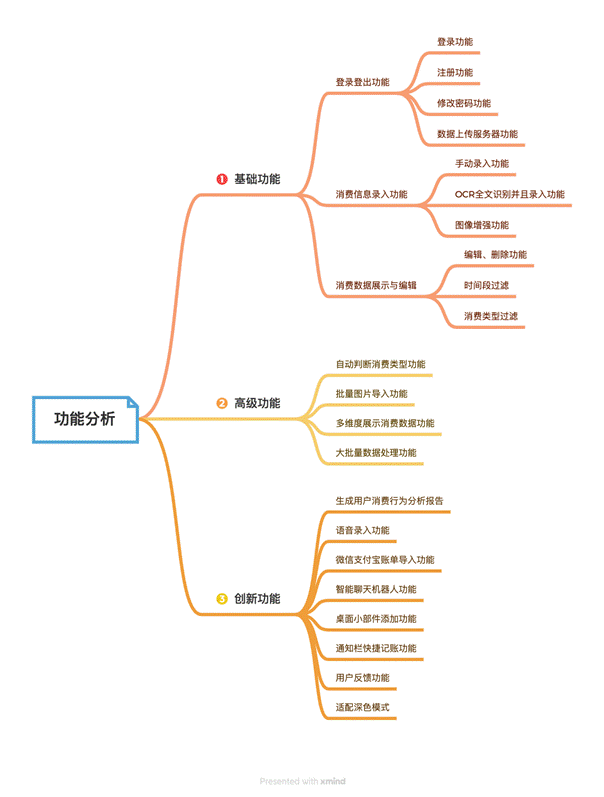

### 3.1 基础功能

1. 具备跨设备数据同步功能

   (1) 登录登出修改密码功能  
   图3.2 调整到登录界面

   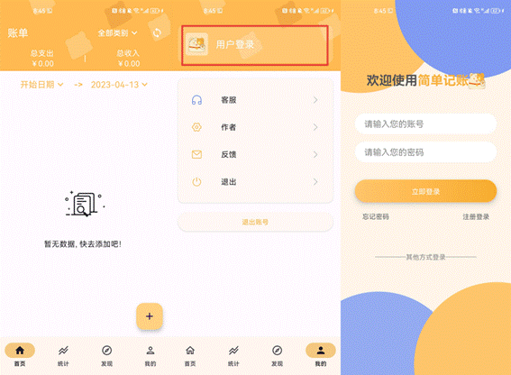

   图3.3 登录、注册、修改密码功能

   

2. 消费信息录入功能

   图3.5 首页

   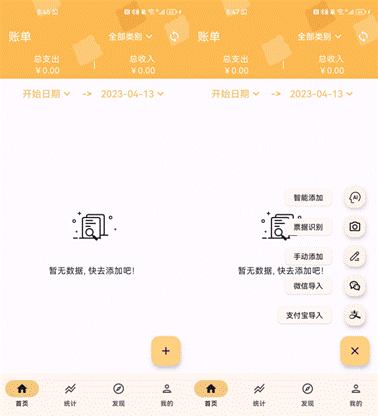

   (1) 手动录入

   图3.6 手动录入功能

   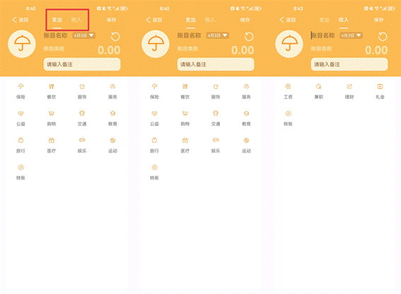

   图3.7 手动录入功能

   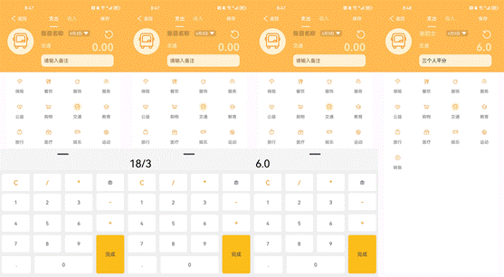

   (2) 图片OCR全文识别录入

   图3.8 拍照功能

   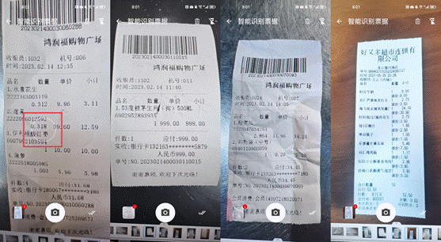

   图3.9 批量数据导入功能

   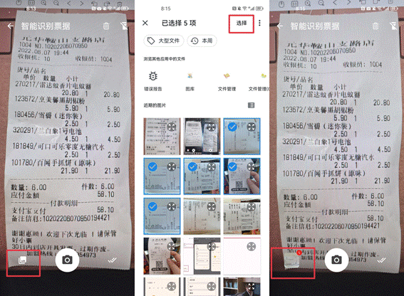

   (3) 图像增强处理

   图3.10 图像增强功能

   

3. 消费数据

   (1) 展示

   (2) 编辑

   图3.11 数据修改和删除功能

   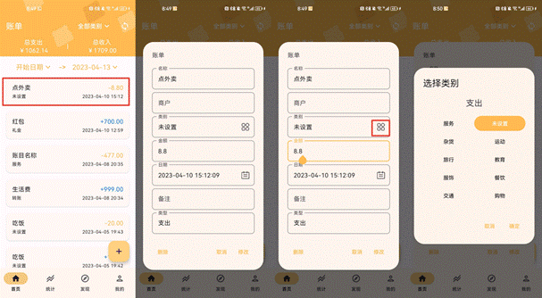

   (3) 通过时间段进行搜索过滤

   图3.12 时间段过滤功能

   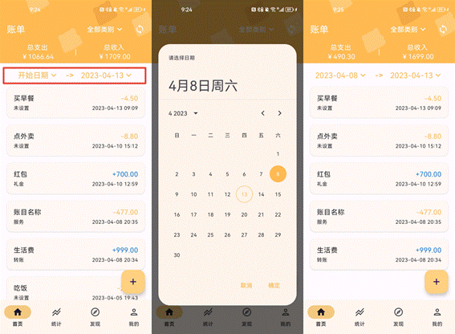

   (4) 通过消费类型进行搜索过滤

   图3.13 消费类型过滤功能

   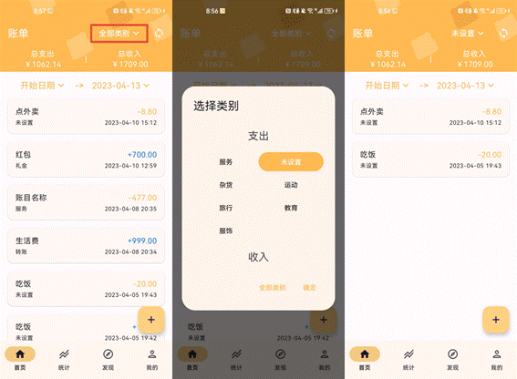

### 3.2 高级功能

1. 自动判断消费类型

   图3.14 图像增强功能

   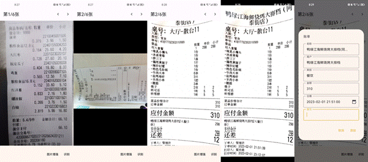

2. 批量图像导入

   图3.15 批量数据导入功能

   

3. 多维度展示消费数据——折线图、饼状图

   图3.16 多维度展示消费数据功能

   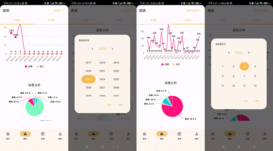

4. 支持多种消费凭据类别

5. 大批量数据测试

   图3.17 大批量数据测试功能

   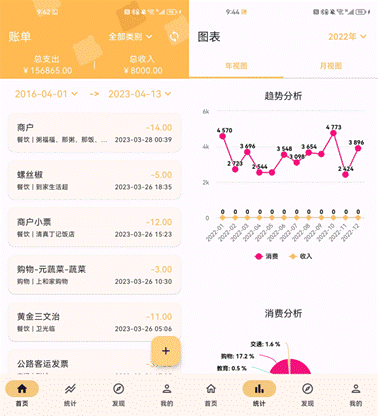

   图3.18 存储的数据

   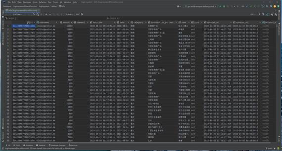

6. 个人健康管理功能（更多见创新功能）

   图3.19 聊天小助手

   

### 3.3 创新功能

1. 拍照界面

   图3.19 拍照功能

   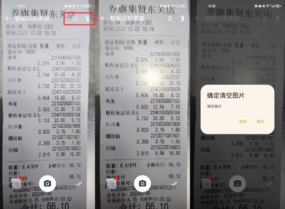

2. 语音录入信息，通过语句生成账单

   图3.20 语音录入功能

   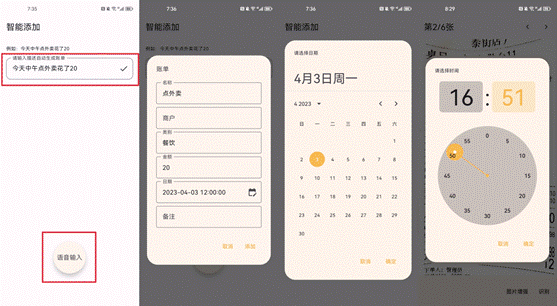

3. 微信支付宝导入账单

   图3.21 微信支付宝账单导入功能

   

4. 对话机器人，回答用户问题

   图3.22 聊天小助手

   

5. 桌面小组件快捷跳转，展示最近消费

   图3.23 桌面小部件快捷记账功能

   

6. 通知栏记账提醒和快捷记账

   图3.24 通知栏快捷记账功能

   

7. 用户反馈功能

   图3.25 用户反馈功能

   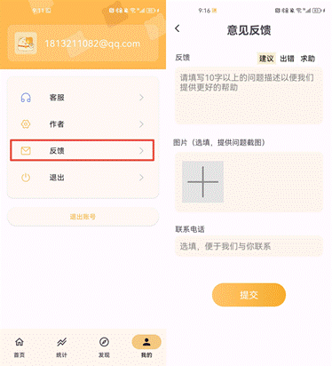

8. 生成用户消费报告

   图3.26 用户消费行为分析报告

   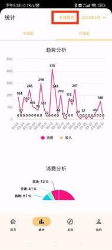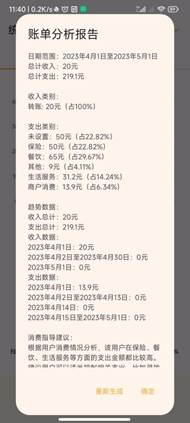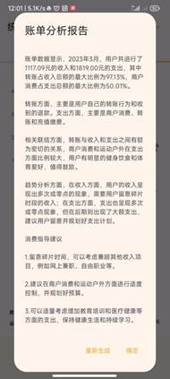

9. 深色模式

   图3.27 深色模式界面

   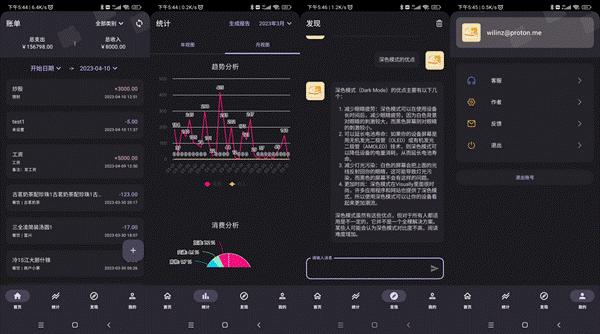

## 4 特色综述

1. 采用合合信息提供的OCR全文识别和图像增强接口，自动识别和录入消费信息，提高用户体验。

2. 适配深色模式：减少周围环境的干扰，从而提高文字、图片等内容的可读性。

3. 桌面小组件：快捷查看消费信息与跳转记账。

4. 语音录入：语音录入功能，让一段语音就能生成一张账单。

5. 用户反馈：帮助管理员了解应用程序的优缺点，优化应用程序的功能和性能。

## 5 开发工具和技术

我们的产品是一款基于安卓平台的应用程序，采用了先进的开发技术。我们使用Android
Studio作为开发平台，采用Kotlin语言和Java语言进行开发，并且采用MVVM框架来实现应用程序的UI（视图）与状态和行为（模型和视图模型）之间的分离，以提高代码的可读性和可维护性。我们还利用Retrofit进行网络请求，并使用Room数据库进行本地数据存储，以方便地进行数据的读取和存储。为了提高构建速度，我们使用了Material3组件和Compose声明式编程，从而使应用程序更加美观。我们还采用Github作为代码托管平台进行协同开发，并利用Figma进行界面UI的构建，以提高开发和设计效率。

## 6 应用对象

软件适用于所有需要管理自己财务状况的人群，包括学生、上班族、自由职业者等等。无论收入和支出情况如何，软件都可以帮助用户更好地掌握自己的财务状况。

## 7 应用环境

Android 手机

## 8 结语

我们在完成基础功能和高级功能的基础上，进行了多项创新，方便用户高效，快捷记账。软件采用了如MVVM、Compose等先进的技术，具有多项强大的功能，可以有效地帮助用户管理个人财务，让用户更好地了解自己的消费情况，合理规划财务，是一款实用性和便捷性都非常高的AI记账软件。

 
